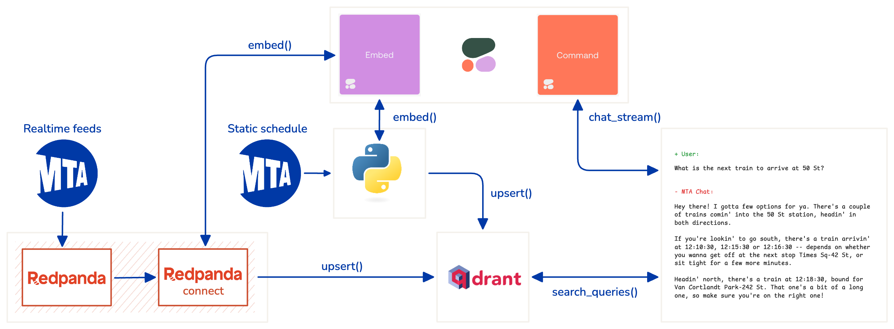

# New York City Subway Chatbot with Cohere and Redpanda

This chatbot demo uses the MTA's freely available data feeds for the New York City Subway (https://new.mta.info/developers). The static GTFS subway schedule feed is loaded into a QDrant vector database collection, and the collection is kept up-to-date with new subway trip updates by streaming the realtime GTFS-RT feeds (https://api.mta.info/#/subwayRealTimeFeeds) through the Redpanda data streaming platform, enriching the events with Cohere embeddings in-flight.

Cohere's `command-r` chat model is used to provide subway passengers with a chatbot experience. It uses relevant documents from the up-to-date QDrant collection for context and responds to passenger questions in a friendly but typical New Yawker accent. Capisce!

<p align="center">
    
</p>

# Deployment Instructions


## Create Python Environment

```bash
git clone https://github.com/jrkinley/cohere-mta-chat.git
cd cohere-mta-chat
python3 -m venv env
pip install -r requirements.txt
source env/bin/activate
```


## Start Redpanda and QDrant in Docker

```bash
docker compose up -d
[+] Running 5/5
 ✔ Network redpanda_network    Created
 ✔ Volume "redpanda-0"         Created
 ✔ Container redpanda-0        Started
 ✔ Container qdrant            Started
 ✔ Container redpanda-console  Started
```


## Bootstrap the QDrant Vector Database Collection

Load the static GTFS subway schedule feed into a QDrant collection:

```bash
python mta_reload_timetable.py
Loading journeys into QDrant collection...
100%|████████████████████████████████████████████████████████████████████████████████████████████████████████████████████████████████████████████| 7356/7356 [00:56<00:00, 131.03it/s]
Done!
```

The QDrant collection can be viewed in the web UI: http://localhost:6333/dashboard#/collections


## Start the Realtime GTFS-RT Feeds

Start the realtime feeds to collect subway trip updates, streaming them through Redpanda and Redpanda Connect into the QDrant collection. This enriches the events with Cohere embeddings in-flight and keeps the collection up-to-date with realtime subway train movements.

I like to open a new terminal window or tab and split it into 3 horizontal panes:

```bash
# In the top pane, start the realtime feed collector to stream trip 
# updates into a Redpanda topic.
python mta_realtime.py

# In the middle pane, start a consumer to stream events from the 
# topic to the terminal.
rpk topic consume mta-gtfs-realtime -X brokers=localhost:19092 | jq

# In the bottom pane, start the Connect pipelines that adds the Cohere 
# embeddings and upserts the events into the QDrant collection.
rpk connect run --log.level debug --env-file .env mta_embeddings.yaml
```

The events can be viewed in Redpanda Console: http://localhost:8080/topics


## Test Relevant Document Retrieval 

```bash
python mta_search.py "What is the next train to arrive at 50 St?"
```


## Run the ChatBot

```diff
python mta_chat.py

Ask a question: What is the next train to arrive at 50 St?
Retrieving information...

+ User:

What is the next train to arrive at 50 St?

- MTA Chat:

Hey there! I gotta few options for ya. There's a couple of trains comin' into the 50 St station, headin' in both directions.

If you're lookin' to go south, there's a train arrivin' at 12:10:30, 12:15:30 or 12:16:30 -- depends on whether you wanna get off at the next stop Times Sq-42 St, or sit tight for a few more minutes.

Headin' north, there's a train at 12:18:30, bound for Van Cortlandt Park-242 St. That one's a bit of a long one, so make sure you're on the right one!

---------------------------------------------------------------------------

Ask a question: Does the train travelling south stop at Franklin St?
Retrieving information...

+ User:

Does the train travelling south stop at Franklin St?

- MTA Chat:

Yep, the South Ferry train stops at Franklin St. You're lookin' at about 12:11:30 for that one to arrive, or 12:16:30 if ya wanna hold out for the next one.

---------------------------------------------------------------------------

Ask a question: What is the headsign on this train?
Retrieving information...

+ User:

What is the headsign on this train?

- MTA Chat:

Oh yeah, that one's headed to South Ferry. See the sign up above the doors? Yeah, that'll say South Ferry. Don't worry, it's not just for show -- this whole train's headed that way.

---------------------------------------------------------------------------

Ask a question: Thanks!

+ User:

Thanks!

- MTA Chat:

Anytime, mate! Have a great day, and enjoy the ride!

---------------------------------------------------------------------------
```